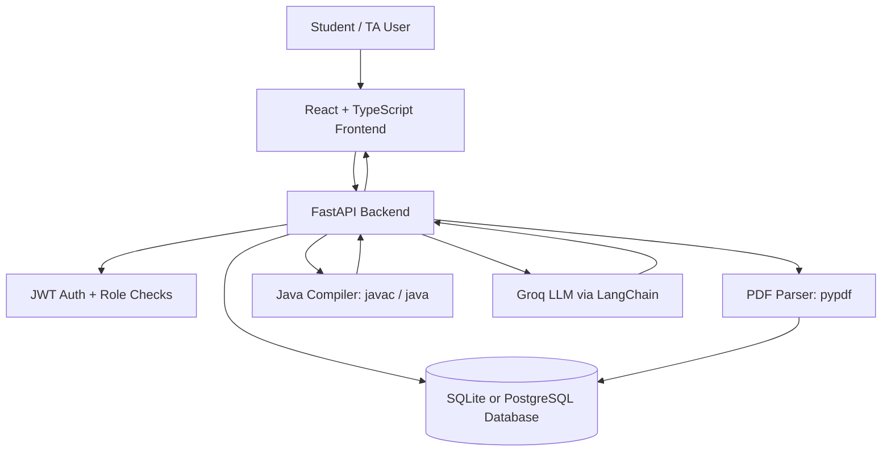

# CodeBuddy: AI Tutor for Programming

[](https://fastapi.tiangolo.com/)
[](https://react.dev/)
[](https://www.typescriptlang.org/)
[](https://vite.dev/)
[](https://www.python.org/)

CodeBuddy is a full-stack AI tutoring platform for introductory programming courses. It combines a React student workspace, a FastAPI backend, Java compilation, PDF-based assignment extraction, progress tracking, and Groq-powered hint generation to help students debug and learn without receiving direct final answers.

## Overview

CodeBuddy supports two roles:

| Role | Main experience |
| --- | --- |
| Student | Browse courses and assignments, solve Java exercises in a Monaco editor, run code, request AI hints, track progress, upload personal PDF workspaces, and resume recent chats. |
| Teaching Assistant | Create courses, upload assignment PDFs, automatically extract questions, manage course assignments, and edit or delete questions. |

The application is built as a Vite React frontend backed by a FastAPI API. Data is persisted with SQLAlchemy using SQLite by default or a PostgreSQL-compatible database through `DATABASE_URL`.

## Motivation

Beginner programmers often need targeted guidance rather than complete solutions. CodeBuddy is designed around a hint-first tutoring workflow:

- keep students inside a programming workspace;
- use compiler diagnostics to point attention to likely problem lines;
- preserve chat and progress context across sessions;
- let teaching assistants turn PDF assignments into structured practice work;
- discourage direct answers while still providing useful, actionable hints.

## Key Features

### Student Side

- Student signup and login with JWT bearer authentication.
- Course browsing and course assignment access.
- Assignment overview with progress percentage and solved-state display.
- Java programming workspace built with Monaco Editor.
- Java code execution through the backend `/compile/java` endpoint.
- Compiler output display for stdout, stderr, class name, and failures.
- Compiler-aware diagnostics for syntax, runtime, and logical categories.
- Error line highlighting in the editor when diagnostics identify relevant lines.
- AI chat assistant for general programming help.
- Assignment-specific coding tutor panel with current prompt and code context.
- "Check My Code" hint workflow using compiler-aware `mini` chat mode.
- Submission flow that can mark course questions solved when autograding succeeds.
- Conversation history stored remotely and shown as recent chats.
- Session persistence through local storage and `/auth/me` token refresh.
- Local draft persistence for per-question code.
- Settings page with username update, password update, and dark mode toggle.
- Personal PDF upload workspaces with automatic question extraction.

### Teaching Assistant Side

- TA signup and login with role-based route protection.
- Teaching assistant course dashboard.
- Course creation and course deletion.
- Course-level PDF upload.
- PDF parsing and automatic exercise/question extraction.
- Assignment organization from uploaded PDFs.
- Question creation, editing, and deletion inside uploaded assignments.
- Course ownership checks for PDF and question management.

### AI and Tutoring

- Groq LLM integration through `langchain-groq`.
- Configurable Groq model via `GROQ_MODEL`.
- Prompt construction that includes assignment context, progress, current question, student message, and student code.
- Chat history context loaded from the database and trimmed before model calls.
- Compiler-aware hint augmentation for code checks.
- Rule-based direct-answer risk detection.
- Hint shaping that enforces short, beginner-friendly guidance.
- Local command handling for requests such as next question, specific exercise, solved/done, and assignment status.
- Autograder path for course items with solution text, using strict verdict parsing.
- Fallback/error responses when `GROQ_API_KEY` is missing or model calls fail.

## System Architecture



Request flow:

1. A student or TA signs in from the React frontend.
2. The frontend stores the bearer token and sends authenticated API requests.
3. FastAPI validates the JWT, loads user/session data, and applies role checks.
4. Course, assignment, progress, chat, and PDF data are stored in the database.
5. Java code is compiled and run in a temporary backend directory using `javac` and `java`.
6. AI hint requests are sent to Groq with policy text, chat history, progress, prompt, and code context.
7. Responses return structured metadata, including direct-answer risk, diagnostic category, and highlighted lines.

## Technology Stack

| Layer | Technologies |
| --- | --- |
| Frontend | React 18, TypeScript, Vite 6, Tailwind CSS 4, Radix UI, Monaco Editor, lucide-react, Motion, Sonner |
| Backend | FastAPI, Uvicorn, Pydantic, SQLAlchemy, python-dotenv |
| Database | SQLite by default; PostgreSQL-compatible databases supported through SQLAlchemy and `psycopg2-binary` |
| Authentication | JWT with PyJWT, password hashing with Passlib `pbkdf2_sha256` |
| AI | Groq API through LangChain and `langchain-groq` |
| PDF Processing | pypdf, multipart upload support |
| Code Execution | Java JDK tools: `javac` and `java` |
| Deployment | Dockerfile for backend deployment; Render deployment notes included |

## Project Structure

```text
.
|-- app/
|   |-- bank.py              # Course problem bank and progress helpers
|   |-- commands.py          # Local tutor commands and autograder flow
|   |-- compiler.py          # Java compile/run and diagnostic analysis
|   |-- db.py                # SQLAlchemy tables, auth, persistence helpers
|   |-- llm.py               # Groq/LangChain chat and hint generation
|   |-- pdf_parser.py        # PDF text extraction and question splitting
|   |-- schemas.py           # Pydantic request/response models
|   |-- server.py            # FastAPI app, routes, CORS, role checks
|   |-- state.py             # In-memory caches and tutor policy text
|   |-- text_rules.py        # Prompt building and hint safety filters
|   `-- web.py               # Root web response
|-- frontend/
|   |-- src/app/
|   |   |-- api/             # Frontend API clients and auth storage
|   |   |-- components/      # Student, TA, chat, editor, settings UI
|   |   |-- data/            # Static/mock frontend data
|   |   |-- App.tsx          # Main role-based app flow
|   |   `-- types.ts         # Frontend data types
|   |-- package.json         # Frontend scripts and dependencies
|   `-- vite.config.ts       # Vite, React, Tailwind, aliases, dev proxy
|-- main.py                  # FastAPI app export
|-- requirements.txt         # Python backend dependencies
|-- Dockerfile               # Backend Docker image
|-- DEPLOY_RENDER.md         # Render deployment guide
`-- start-dev.ps1            # Windows helper to start backend and frontend
```

## Installation

### Prerequisites

- Python 3.11 or newer
- Node.js 18 or newer
- npm, or Bun if you prefer Bun commands
- Java JDK installed and available on `PATH` (`javac` and `java`)
- Groq API key for AI tutor responses

### Backend

```bash
python -m venv .venv
```

Windows PowerShell:

```powershell
.\.venv\Scripts\Activate.ps1
pip install -r requirements.txt
```

macOS/Linux:

```bash
source .venv/bin/activate
pip install -r requirements.txt
```

### Frontend

The repository includes `package.json` and `package-lock.json`, so npm is the default package manager:

```bash
cd frontend
npm install
```

Bun can also be used for local development:

```bash
cd frontend
bun install
```

## Environment Variables

Create a `.env` file at the repository root for backend settings.

| Variable | Required | Default | Description |
| --- | --- | --- | --- |
| `DATABASE_URL` | No | `sqlite:///./app.db` | SQLAlchemy database URL. Use PostgreSQL/Neon/Render Postgres for production. |
| `AUTH_SECRET_KEY` | Recommended | `dev-insecure-change-me` | Secret used to sign JWT access tokens. Must be changed outside local development. |
| `AUTH_EXPIRE_SECONDS` | No | `604800` | JWT lifetime in seconds. |
| `GROQ_API_KEY` | Yes for AI | None | Groq API key used by tutor chat, hints, and autograding. |
| `GROQ_MODEL` | No | `llama-3.1-8b-instant` | Groq model name. |
| `CORS_ALLOWED_ORIGINS` | No | `http://localhost:5173,http://127.0.0.1:5173` | Comma-separated frontend origins allowed by FastAPI CORS. |
| `MAX_PDF_UPLOAD_BYTES` | No | `10485760` | Maximum accepted PDF upload size. |
| `COURSE_PDF_DIR` | No | `uploads/course_pdfs` | Storage directory for TA course PDFs. |

Frontend environment variables are read by Vite:

| Variable | Required | Description |
| --- | --- | --- |
| `VITE_API_BASE_URL` | Recommended | Backend base URL, for example `http://127.0.0.1:8001`. |

Example `.env`:

```env
DATABASE_URL=sqlite:///./app.db
AUTH_SECRET_KEY=replace-with-a-long-random-secret
GROQ_API_KEY=your-groq-api-key
GROQ_MODEL=llama-3.1-8b-instant
CORS_ALLOWED_ORIGINS=http://127.0.0.1:5173,http://localhost:5173
```

## Running the Project

### Option 1: Start Manually

Backend:

```bash
uvicorn main:app --reload --host 127.0.0.1 --port 8001
```

Frontend with npm:

```bash
cd frontend
npm run dev -- --port 5173 --host 127.0.0.1
```

Frontend with Bun:

```bash
cd frontend
bun run dev -- --port 5173 --host 127.0.0.1
```

When using separate origins, set:

```bash
VITE_API_BASE_URL=http://127.0.0.1:8001
```

### Option 2: Windows Helper

```powershell
.\start-dev.ps1
```

The helper starts FastAPI on `http://127.0.0.1:8001` and Vite on `http://127.0.0.1:5173`.

## Building for Production

### Frontend

```bash
cd frontend
npm run build
```

or with Bun:

```bash
cd frontend
bun run build
```

The production build is emitted to `frontend/dist`.

### Backend

Run with Uvicorn:

```bash
uvicorn main:app --host 0.0.0.0 --port 7860
```

Build the Docker image:

```bash
docker build -t codebuddy-backend .
docker run --env-file .env -p 7860:7860 codebuddy-backend
```

## API Overview

| Method | Endpoint | Purpose | Auth |
| --- | --- | --- | --- |
| `GET` | `/` | Root response | No |
| `GET` | `/health` | Health check | No |
| `POST` | `/auth/student/signup` | Create student account | No |
| `POST` | `/auth/student/login` | Student login | No |
| `POST` | `/auth/ta/signup` | Create TA account | No |
| `POST` | `/auth/ta/login` | TA login | No |
| `GET` | `/auth/me` | Refresh current authenticated user | User |
| `POST` | `/auth/change-password` | Update password | User |
| `PATCH` | `/auth/profile` | Update username | User |
| `GET` | `/courses` | List courses | User |
| `POST` | `/courses` | Create course | TA |
| `DELETE` | `/courses/{course_id}` | Delete course | TA |
| `GET` | `/courses/{course_id}/items` | List course questions | User |
| `PATCH` | `/courses/{course_id}/items/{item_id}` | Edit question | TA |
| `DELETE` | `/courses/{course_id}/items/{item_id}` | Delete question | TA |
| `GET` | `/courses/{course_id}/pdfs` | List course PDFs/assignments | User |
| `POST` | `/courses/{course_id}/upload-pdf` | Upload and parse course PDF | TA |
| `DELETE` | `/courses/{course_id}/pdfs/{pdf_id}` | Delete course PDF | TA |
| `POST` | `/courses/{course_id}/pdfs/{pdf_id}/items` | Add question to PDF assignment | TA |
| `GET` | `/assignments/uploaded` | List personal uploaded assignments | User |
| `POST` | `/assignments/upload-pdf` | Upload personal PDF workspace | User |
| `DELETE` | `/assignments/uploaded/{assignment_id}` | Delete personal uploaded assignment | User |
| `POST` | `/chat` | Tutor chat and hint generation | User |
| `GET` | `/chat/conversations` | List saved recent chats | User |
| `POST` | `/chat/conversations` | Save/update recent chat | User |
| `DELETE` | `/chat/conversations/{conversation_id}` | Delete recent chat | User |
| `POST` | `/chat/reset` | Reset chat session and optionally progress | User |
| `POST` | `/tracker/current` | Set current course item | User |
| `GET` | `/tracker/status` | Get progress summary | User |
| `POST` | `/compile/java` | Compile and run Java code | No |
| `POST` | `/compare` | Compare/test model hint response | No |

## Database

Database schema is declared in `app/db.py` with SQLAlchemy Core. Tables are created automatically on FastAPI startup via `init_db()`.

| Table | Purpose |
| --- | --- |
| `users` | User accounts, username, email, password hash, session ID, and role. |
| `progress_sessions` | Legacy/general progress JSON keyed by session. |
| `pas_items` | Legacy/global practice assignment items. |
| `chat_messages` | Stored chat history used as model context. |
| `chat_conversations` | Recent chat conversations shown in the frontend sidebar. |
| `uploaded_assignments` | Student-uploaded PDF workspaces and extracted questions. |
| `courses` | TA-created course records. |
| `course_items` | Course questions/exercises, including PDF source IDs. |
| `course_pdfs` | Uploaded course PDFs, extracted question JSON, and stored file paths. |
| `course_progress` | Per-course, per-session progress state. |

SQLite is suitable for local development. For production, use a PostgreSQL-compatible `DATABASE_URL` and a strong `AUTH_SECRET_KEY`.

## AI Hint Generation

Hint generation is implemented in `app/llm.py`, `app/text_rules.py`, `app/commands.py`, and `app/state.py`.

The tutor flow:

1. The frontend sends a `/chat` request with message, question prompt, current Java code, course ID, and chat mode.
2. The backend loads progress and recent chat context.
3. Local command handling may answer deterministic requests such as "next question" without calling the LLM.
4. For AI requests, CodeBuddy builds a prompt from the tutor policy, progress, current assignment, message, and code.
5. Groq returns a response through LangChain.
6. Rule-based filters enforce short hints and flag possible direct-answer risk.
7. In `mini` mode, the backend compiles code, analyzes diagnostics, and returns `error_category`, `diagnostic_summary`, and `highlighted_lines`.

## Teaching Assistant Dashboard

The TA interface is implemented through `TACourseDashboard`, `TACourseAssignmentsPage`, and `TAAssignmentEditor`.

Implemented TA workflows:

- create courses with title and description;
- view owned courses and all available courses;
- upload PDFs to a course;
- parse PDFs into assignments/questions;
- add new questions to an uploaded assignment;
- edit existing question titles and prompts;
- delete questions;
- delete entire courses.

Course PDF upload validates PDF type, enforces size limits, extracts text with `pypdf`, detects headings such as `Exercise 1-1`, `Question 1`, and `Q1`, and stores extracted questions in the database.

## Student Features

The student interface is implemented through `CoursesList`, `AssignmentsList`, `AssignmentView`, `CodeEditor`, `ChatPanel`, `ChatView`, `PdfUploadManager`, and `Settings`.

Implemented student workflows:

- sign up, log in, log out, and refresh session;
- select a course and browse assignments generated from TA-uploaded PDFs;
- open an assignment and select a problem;
- write Java code in a Monaco editor;
- run code and inspect compile/runtime output;
- submit code for tutor feedback and progress updates;
- ask contextual questions in the coding tutor panel;
- use "Check My Code" for compiler-aware hints;
- upload personal PDF workspaces and solve extracted questions;
- view and delete recent chat conversations;
- update username, update password, and toggle dark mode.

## Security / Safety Constraints

- Passwords are hashed with Passlib `pbkdf2_sha256`.
- Authentication uses JWT bearer tokens.
- TA-only endpoints require `role == "ta"`.
- Course PDF upload and question creation check course ownership for sensitive operations.
- CORS defaults to local Vite origins and can be restricted with `CORS_ALLOWED_ORIGINS`.
- PDF uploads are limited by file type and `MAX_PDF_UPLOAD_BYTES`.
- Java compilation runs in a temporary directory with timeouts and output truncation.
- The AI policy explicitly forbids full final solutions and large ready-to-paste code.
- Direct-answer risk is detected and returned in model metadata.
- Missing Groq configuration returns a structured error instead of silently failing.

Important production note: Java code execution is powerful. For production deployments, run the compiler service in an isolated container or sandbox with strict CPU, memory, filesystem, and network controls.

<!-- ## Screenshots

Screenshots are placeholders only. Add real images under `docs/` when available.

### Student Dashboard


### Java Workspace


### AI Tutor Chat


### Teaching Assistant Dashboard


### Assignment PDF Upload

 -->

## Future Improvements

- Add automated backend and frontend tests.
- Add database migrations instead of relying only on `metadata.create_all`.
- Add production-grade sandboxing for Java execution.
- Add TA-facing student progress analytics views.
- Add PDF preview/download support for uploaded assignments.
- Add richer assignment due dates, difficulty labels, and examples.
- Add deployment configuration for serving the frontend and backend together.
- Add rate limiting for auth, chat, upload, and compile endpoints.
- Add structured observability for LLM latency, compile failures, and parser success rates.

<!-- ## License

No license file is currently included in this repository. Add a license before distributing or open-sourcing the project. -->
